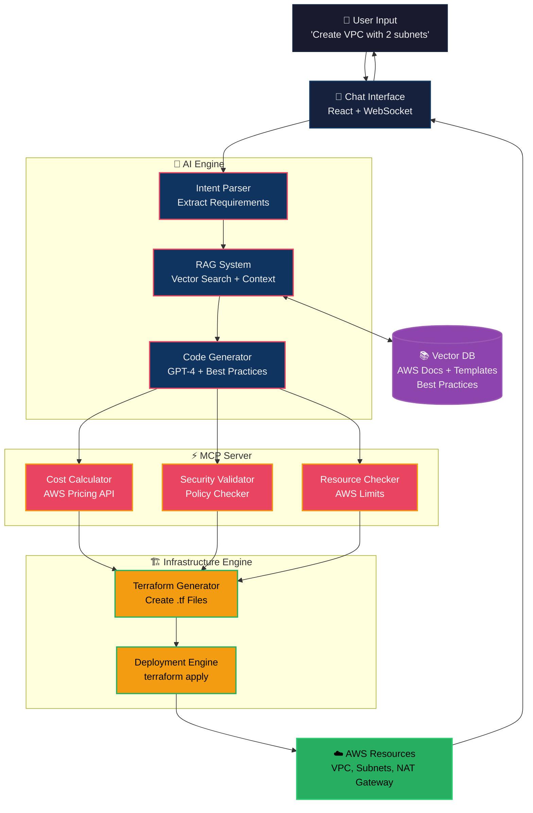
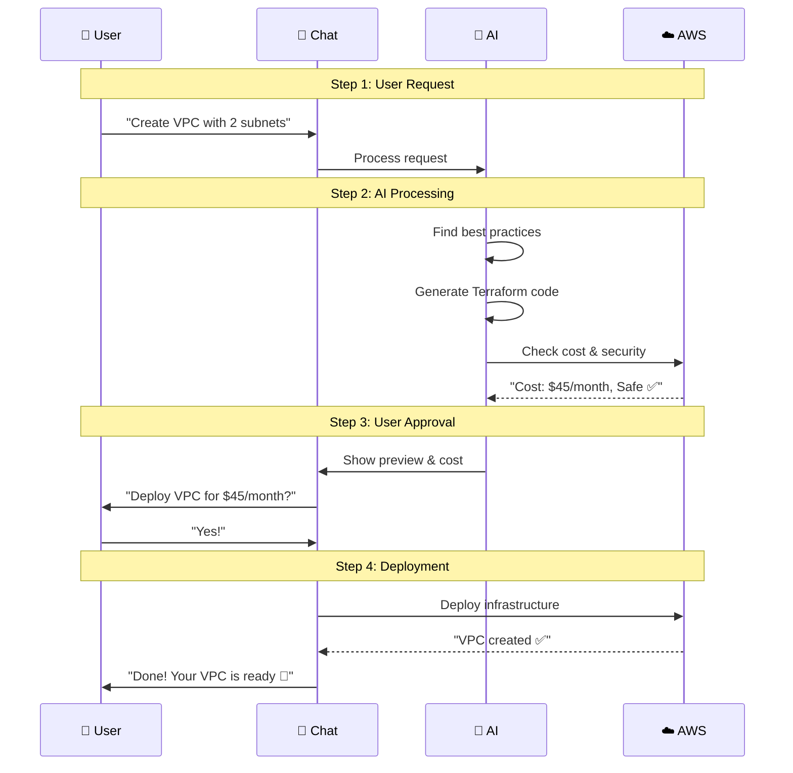

# 🤖 AI DevOps Assistant - Architecture & Flow

## 🏗️ System Architecture



## 🔄 Complete System Flow



## 🎯 How Each Component Works

### 1. **AI Engine Flow**
```
Input: "VPC with 2 subnets" 
  ↓
Intent Parser: {resource: "vpc", subnets: 2, private: true}
  ↓  
RAG Search: Find similar VPC patterns
  ↓
LLM Generate: Create Terraform code with best practices
```

### 2. **RAG System Knowledge**
```
Vector Database Contains:
├── AWS VPC Best Practices
├── Terraform Templates  
├── Security Policies
├── Cost Optimization Tips
└── Your Organization Standards
```

### 3. **MCP Server Validation**
```
Real-time Checks:
├── Cost: $45/month (NAT Gateway $32 + VPC Free)
├── Security: All policies compliant ✅
├── Quotas: 5/20 VPCs used ✅  
└── Dependencies: Subnet → VPC ✅
```

### 4. **Infrastructure Engine**
```
Generated Terraform:
resource "aws_vpc" "main" {
  cidr_block = "10.0.0.0/16"
}

resource "aws_subnet" "private" {
  vpc_id     = aws_vpc.main.id
  cidr_block = "10.0.1.0/24"
}

resource "aws_nat_gateway" "main" {
  subnet_id = aws_subnet.public.id
}
```

## 🚀 Quick Implementation Stack

```yaml
Frontend: React + WebSocket
Backend: FastAPI + Python  
AI: OpenAI GPT-4
RAG: ChromaDB + Embeddings
MCP: Node.js + AWS SDK
IaC: Terraform
Cloud: AWS
```

## 💡 Example End-to-End Flow

**User**: *"I need a 3-tier app with database"*

1. **AI understands**: Web + App + DB tiers
2. **RAG finds**: Enterprise 3-tier templates  
3. **MCP validates**: Cost ~$200/month, quotas OK
4. **User confirms**: "Deploy it"
5. **Terraform creates**: ALB + EC2 + RDS
6. **Result**: Production-ready infrastructure in 5 minutes

---

**Simple. Powerful. Intelligent Infrastructure.**
